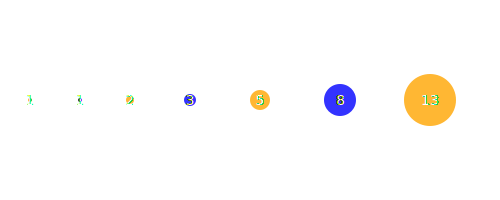

# 💫 About Me:
🧑‍💻 About Me  👋 Hello, I am Gonçalo Cabral Lopes!   • 🖥️ Area: Full Stack Programming.  🚀 What I Do?   • 🎓 Java programming student.  🎮 Hobbies   • 🧩 Puzzle’s  • 🎮 Video games  • 🎥 Movies and Series   • ⚽ Football    💡 Favorite Technologies   • ☕ Java  • 🌱 Spring  • 💻 C#  • 🌀 .NET Framework  • 📱 TypeScript  • 🔺 Angular  • 🐳 Docker  • 💾 SQL Server  • 🧱 SQLite  • ⚙️ Low-code Tools  • 🌐 HTML     🌟 Goals   • 🤝 Collaborations   • 📚 Knowledge sharing   • 🧑‍💻 Professional experience   • ✋ Helping others    📫 Contact   • 🔗 LinkedIn   • ✉️ Email   • 📱 Social media    ✨ Inspirational Quote   > " The people who are crazy enough to think they can change the world are the ones who do."   — Steve Jobs, Co-founder of Apple 🍎

## 🌐 Socials:
    

## 💻 Tech Stack:

  
  
  
  
  
  
  
  
  
  
  
  
  
  
  
  
  
  
  
  
  
  
  
  
  
  
  
  
  
  
  
  
  
  
  
  
  
  
  
  
  
  
  
  
  
  
  
  
  

 

# Fibonacci

